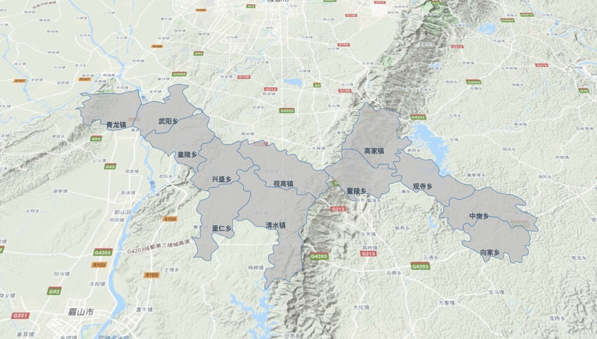

上一章节绘制2D图基本效果完成，这一章节将介绍如何绘制3D图层，3D从视觉角度上来看为立体的图形，根据这一特点我们需绘制有高度的边界值即可；

##### 一、视觉角度偏移

初始化地图时，添加属性`pitch`，视角偏移，更改代码如下：

    

###### 效果图如下：

添加属性前：

添加属性后：

##### 二、绘制整体区域边框等高线

绘制区域面、边框线时需增加`altitude`属性

2.1 上一章节提到的绘制面 `drawPolygons()` 方法中增加`altitude`属性，代码如下

    

2.2 绘制区域边界线，可根据绘制区域json进行合并，合并数据网址[http://mapshaper.org/](http://mapshaper.org/)

比如我要合并的地图文件为`test.json`;

    [{"type": "Feature", "properties":{"name": "广东","alias": "两广地区"}},
    {"type": "Feature", "properties":{"name": "广西","alias": "两广地区"}}]

在mapshaper.org网站，开启控制台；

    dissolve 'alias' -o test.json
    
即可得到处理后的json数据

通过`maptalks.MultiLineString()`绘制等高线代码如下：
    
    

3D图形绘制完成，效果图如下：

完整代码地址：[3D图形](https://github.com/dcbase/maptalksDemo/blob/master/3d03.html)
