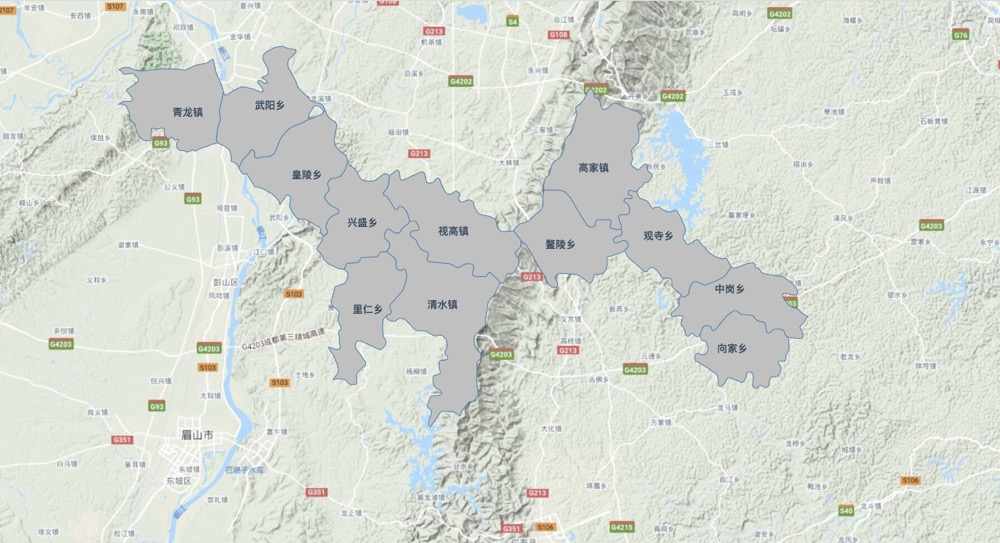

###### 一、地图初始化绘制

可参考[官方文档--Example--初始化](https://maptalks.org/examples/en/map/load/)测试用例；

maptalks.css、maptalks.min.js必须加载

地图初始化主要问题为 底图、地图中心点位置、地图缩放大小 

[demo01](https://github.com/dcbase/maptalksDemo/blob/master/init.html)

    <!DOCTYPE html>
    <html>
      <meta charset="UTF-8">
      <meta name="viewport" content="width=device-width, initial-scale=1">
      <title>Map - Display a map</title>
      
      <link rel="stylesheet" href="https://cdn.jsdelivr.net/npm/maptalks/dist/maptalks.css">
      
      <body>
    
        

    
        
      </body>
    </html>

###### 二、绘制区域块

可参考[官方文档--Example--绘制区域（ Polygon ）](https://maptalks.org/examples/en/geometry/polygon/#geometry_polygon)测试用例；

需要引入相关区域json，绘制区域块是通过点位连接绘制线、面，所以需引入相关地级市GeoJson格式的数据(示例json:[meishan.json](https://github.com/dcbase/maptalksDemo/blob/master/json/meishan.json))，相关代码 [github](https://github.com/dcbase/maptalksDemo/blob/master/3d.html)

相关代码如下：

    

###### 三、绘制区域名称

可参考[官方文档--Example--绘制文字图层（ Label ）](https://maptalks.org/examples/cn/geometry/label/)测试用例；

在文档中暂未找到可以直接绘制面是添加文字属性，此处则另起一个文字图层进行叠加，在原有 `drawPolygons()` 方法中增加 `maptalks.Label()`，相关代码 [github](https://github.com/dcbase/maptalksDemo/blob/master/3d01.html)

相关代码如下：

    
    
    
    
###### 总结  

2D基本地图区域块绘制完成,效果图如下：

