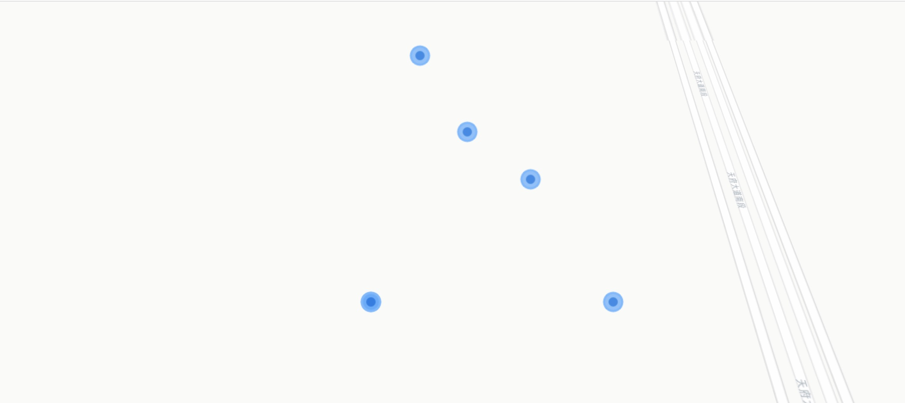
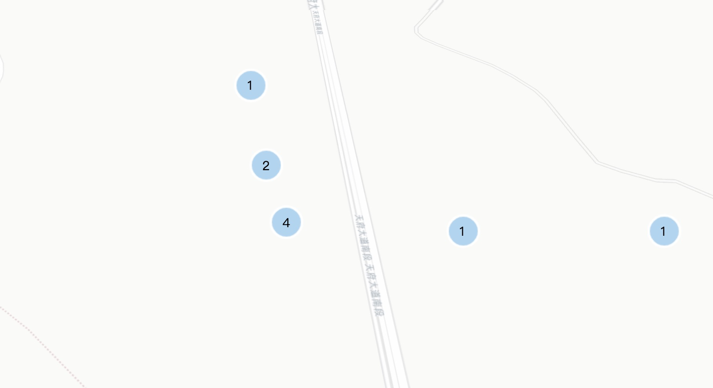

maptalks集成了点聚合插件，需引入插件，可参考[maptalks.markercluster](https://github.com/maptalks/maptalks.markercluster)官方介绍；

    

同时还可以引入动画插件，使整体效果美化，可参考[maptalks.animatemarker](https://github.com/maptalks/maptalks.animatemarker)官方介绍

    
    
    
    

##### 一、初始化地图代码

    //地图底图地址
    let mapUrl = 'https://{s}.basemaps.cartocdn.com/light_all/{z}/{x}/{y}.png'

    //地图中心位置
    let mapCenter = [104.0647600000, 30.2702000000]

    const map = new maptalks.Map('map', {
        center: mapCenter,
        zoom: 10,  //地图放大倍数
        baseLayer: new maptalks.TileLayer('base', {
            urlTemplate: mapUrl,
            subdomains: ['a','b','c','d'],
            attribution: '&copy; <a href="http://osm.org">OpenStreetMap</a> contributors, &copy; <a href="https://carto.com/">CARTO</a>'
        })
    });

##### 二、标点及动画效果

2.1 标点数据

    const addressPoints=[
        [104.0647600000, 30.2802000000, "3"],
        [104.0647600000, 30.2602000000, "10"],
        [104.0647600000, 30.2702000000, "2"],
        [104.0747600000, 30.2702000000, "11"],
        [104.0847600000, 30.2702000000, "3A"],
        [104.0647600000, 30.2702000000, "4D"],
        [104.0347600000, 30.2602000000, "20"],
        [104.0657600000, 30.2732000000, "30"],
        [104.0667600000, 30.2722000000, "1"],
        [104.0677600000, 30.2702000000, "3e"],
        [104.0647600000, 30.2752000000, "5"]
    ]

2.2 绘制标点，地图缩小时，将半径（ maxClusterRadius = 160 默认值可不填写 ）范围内的标点聚合

    //绘制标点样式，新增标点
    let markers = []
    for (let i = 0; i < addressPoints.length; i++) {
        let a = addressPoints[i]
        markers.push(new maptalks.Marker([a[0], a[1]], {
            'symbol': [
                {
                    'markerType': 'ellipse',
                    'markerWidth': 20,
                    'markerHeight': 20,
                    'markerFill': 'rgb(64, 158, 255)',
                    'markerFillOpacity': 0.7,
                    'markerLineColor': '#73b8ff',
                    'markerLineWidth': 3
                },
                {
                    'markerType': 'ellipse',
                    'markerWidth': 10,
                    'markerHeight': 10,
                    'markerFill': '#006ddd',
                    'markerFillOpacity': 0.7,
                    'markerLineWidth': 0
                }
            ]
        }));
    }

    // 聚合效果
    let clusterLayer = new maptalks.ClusterLayer('cluster', markers, {
        'noClusterWithOneMarker': false,
        'maxClusterZoom': 16,
        //"count" is an internal variable: marker count in the cluster.
        'symbol': {
            'markerType': 'ellipse',
            'markerFill': {
                property: 'count',
                type: 'interval',
                stops: [[0, 'rgb(135, 196, 240)'], [9, '#1bbc9b'], [99, 'rgb(216, 115, 149)']]
            },
            'markerFillOpacity': 0.7,
            'markerLineOpacity': 1,
            'markerLineWidth': 3,
            'markerLineColor': '#fff',
            'markerWidth': {property: 'count', type: 'interval', stops: [[0, 40], [9, 60], [99, 80]]},
            'markerHeight': {property: 'count', type: 'interval', stops: [[0, 40], [9, 60], [99, 80]]}
        },
        'drawClusterText': true,
        'geometryEvents': true,
        'single': true
    })
    map.addLayer(clusterLayer)

2.3 添加动画，动画效果可参考 [marker的变形动画](https://maptalks.org/examples/cn/animation/marker-anim/#animation_marker-anim)

    // 执行mark的变形动画
    setInterval(() => {
        replay();
    }, 1500)

    function replay() {
        animate();
        setTimeout(() => {
            reset();
        }, 600)

    }

    // mark的变形动画
    function animate() {
        markers.map((item) => {
            item.animate({
                'symbol': [
                    {
                        'markerWidth': 40,
                        'markerHeight': 40,
                        'markerFillOpacity': 0.2,
                        'markerLineWidth': 1
                    },
                    {
                        'markerWidth': 20,
                        'markerHeight': 20,
                        'markerFillOpacity': 0.4
                    }
                ]
            }, {
                'duration': 600
            });
        })
    }

    // mark的变形动画
    function reset() {
        markers.map((item) => {
            item.animate({
                'symbol': [
                    {
                        'markerWidth': 20,
                        'markerHeight': 20,
                        'markerFillOpacity': 0.7,
                        'markerLineWidth': 3
                    },
                    {
                        'markerWidth': 10,
                        'markerHeight': 10,
                        'markerFillOpacity': 0.7
                    }
                ]
            }, {
                'duration': 600
            });
        })
    }

基本的标点动画效果已完成，效果如下：未提交gif图，先看静态图吧！！！哈哈
 

点聚合效果图：
 
