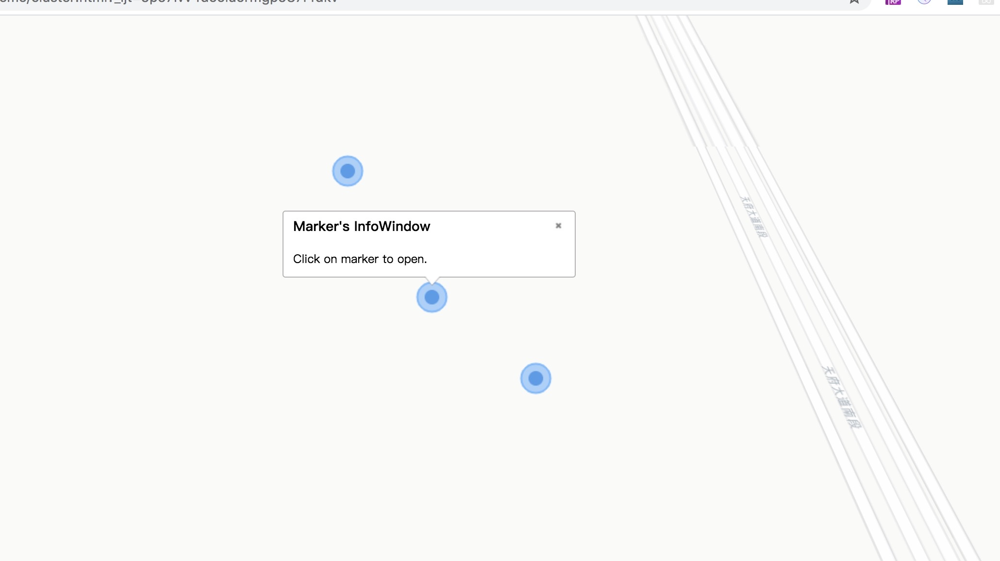

maptalks提供了简单的信息提示框，也可以自定义提示框样式、内容，可参考官网

###### 一、[图形信息框](https://maptalks.org/examples/cn/ui-control/ui-geo-infownd/#ui-control_ui-geo-infownd) 

    <!DOCTYPE html>
    <html>
      <meta charset="UTF-8">
      <meta name="viewport" content="width=device-width, initial-scale=1">
      <title>空间与UI组件 - 图形信息框</title>
      
      <link rel="stylesheet" href="https://cdn.jsdelivr.net/npm/maptalks/dist/maptalks.css">
      
      <body>
    
        

        
      </body>
    </html>
    

###### 二、[自定义信息框](https://maptalks.org/examples/cn/ui-control/ui-custom-infownd/#ui-control_ui-custom-infownd)

    <!DOCTYPE html>
    <html>
      <meta charset="UTF-8">
      <meta name="viewport" content="width=device-width, initial-scale=1">
      <title>空间与UI组件 - 自定义信息框</title>
      
      <link rel="stylesheet" href="https://cdn.jsdelivr.net/npm/maptalks/dist/maptalks.css">
      
      <body>
    
        

        
      </body>
    </html>
    
    
上述是官网提供的两种信息框形式，接下来则是加入到标点点击事件中，结合上一章[点聚合效果](project/markercluster)，在第二部分标点，绘制标点时增加点击事件；

###### 1、点击事件

    // mark点击弹框
    function onClick(e) {
        e.target.setInfoWindow({
            'title'     : 'Marker\'s InfoWindow',
            'content'   : 'Click on marker to open.',
            'dy': 5,
            'autoPan': true,
            'custom': false,
            'autoOpenOn': 'click',  //set to null if not to open when clicking on marker
            'autoCloseOn': 'click'
        })
    }

###### 2、绘制标点时将事件加入

    let markers = []
    for (let i = 0; i < addressPoints.length; i++) {
        let a = addressPoints[i]
        markers.push(new maptalks.Marker([a[0], a[1]], {
            'symbol': [
                {
                    'markerType': 'ellipse',
                    'markerWidth': 20,
                    'markerHeight': 20,
                    'markerFill': 'rgb(64, 158, 255)',
                    'markerFillOpacity': 0.7,
                    'markerLineColor': '#73b8ff',
                    'markerLineWidth': 3
                },
                {
                    'markerType': 'ellipse',
                    'markerWidth': 10,
                    'markerHeight': 10,
                    'markerFill': '#006ddd',
                    'markerFillOpacity': 0.7,
                    'markerLineWidth': 0
                }
            ]
        }).on('mousedown', onClick));
        //此处则是加入点击事件
    }

整体效果图如下：
 
